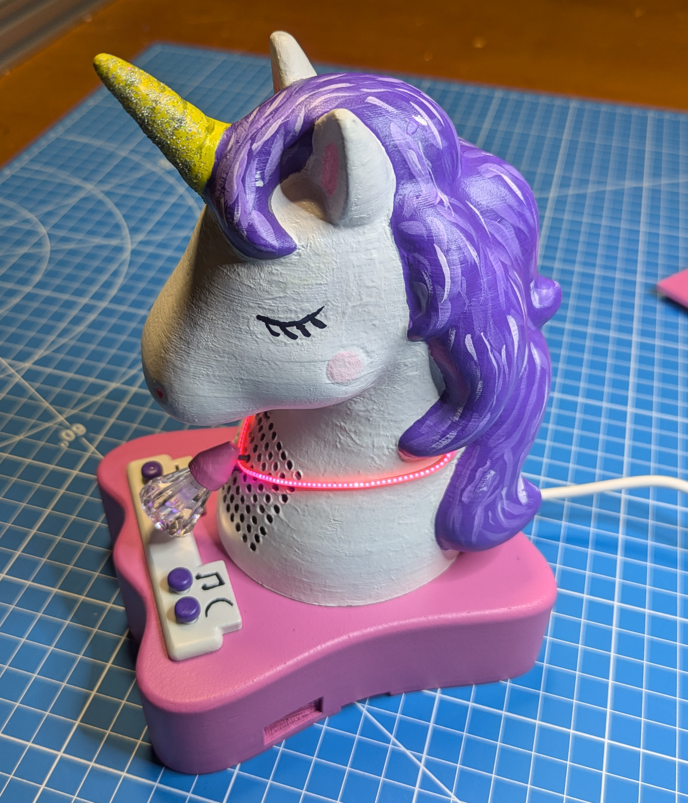
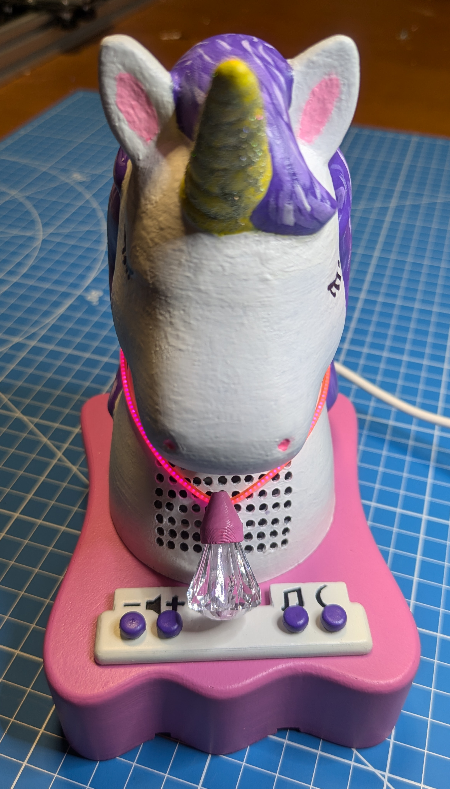
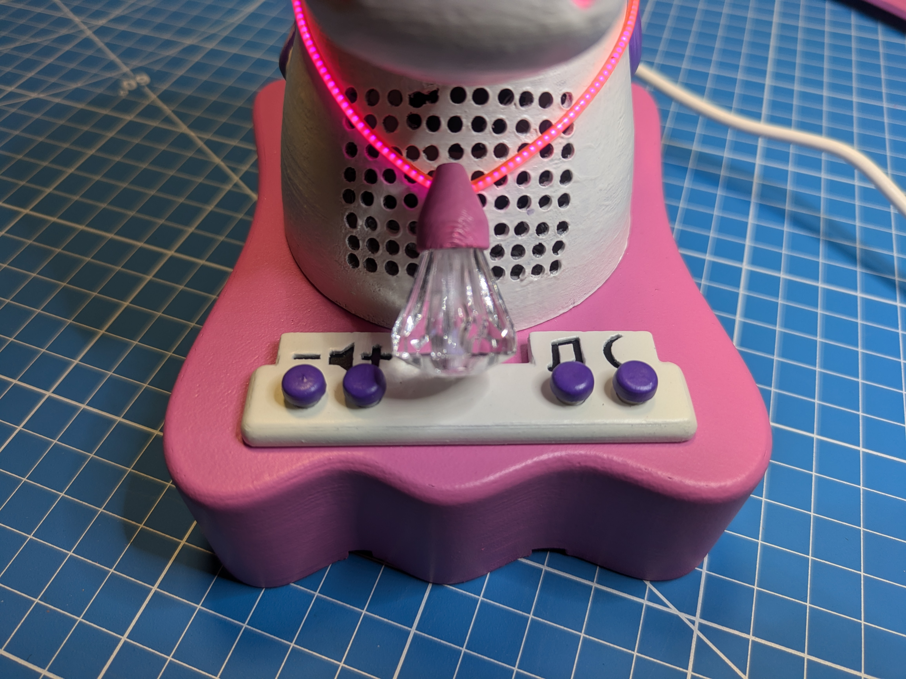
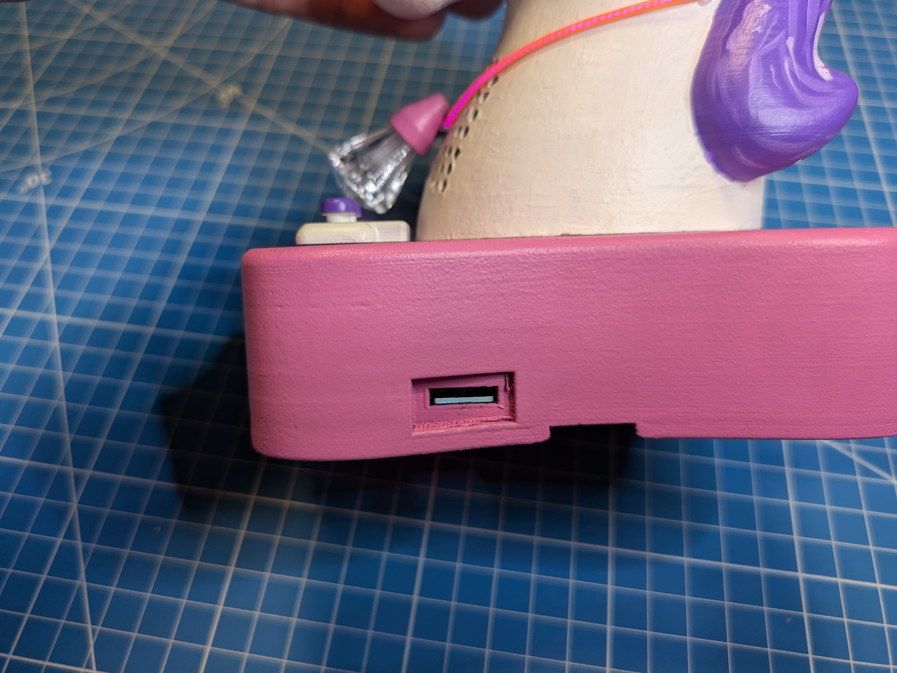
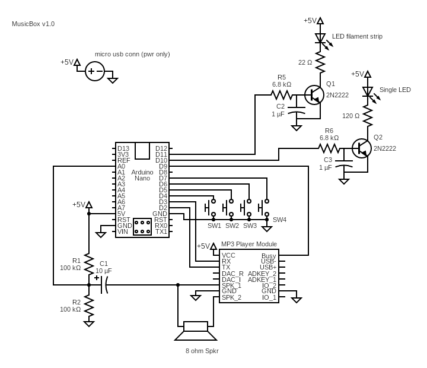
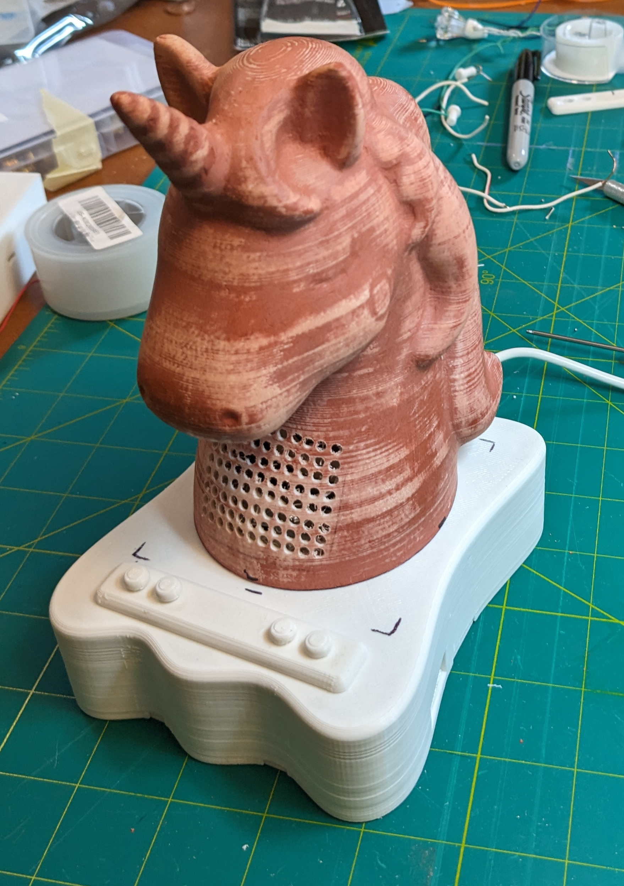
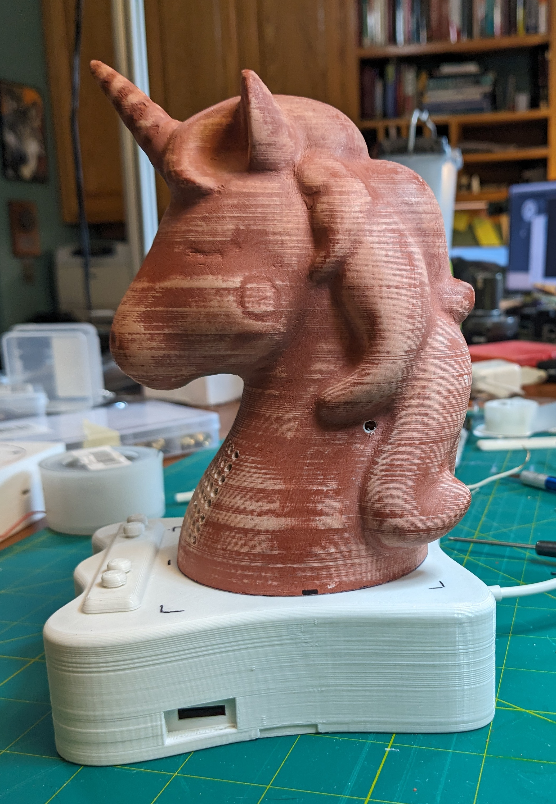
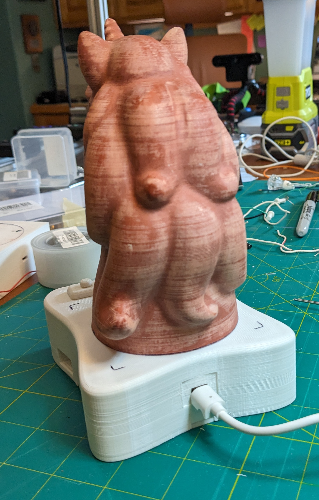
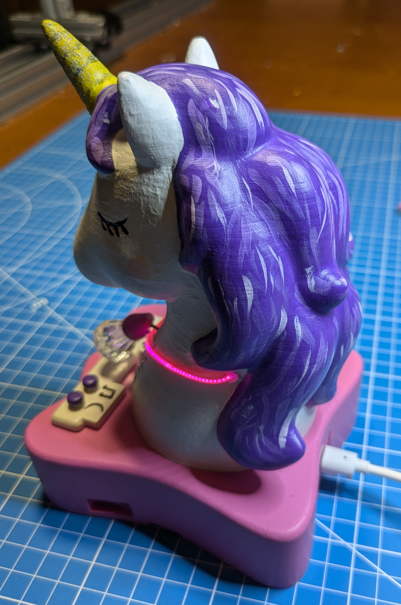

# Music Box

This project implements a simple music player using an Arduino and a dedicated mp3 player module.  The motivation was to create a simple nightstand player for my granddaughter.

See this video for a demo of the player:  https://youtu.be/NVYOizomKiI

 

## Circuit

 
(Drawn using https://www.circuit-diagram.org)

The design uses a dedicated MP3 player module purchased from Amazon for this project plus other on-hand components including an Arduino Nano.  Key functionality:

 * MP3 player module with SD card slot - music is loaded on the SD card (see below).  The program running on the Arduino uses the serial interface of the player to control which mp3 file is played and to control the volume level.  Important: This player module has the same pin-out as the DFPlayer device, but its functionality is not exactly the same.  Credit goes to the various folks who provided an Amazon review of the device and provided clues to using it especially user "Richard Makes Escape Rooms".  The product link is https://www.amazon.com/dp/B07Y2YKYRS?ref=ppx_yo2ov_dt_b_product_details&th=1.  See player.cpp/hpp for the implementation.

 * Arduino Nano - The code of this repo runs on this device.  You could use just about any Arduino or micro for this function.  The program monitors the switch inputs and controls the player module accordingly.  It also flashes the LEDs in either a default 'breathing' mode while not playing where the LED intensity is varied up/down, or flashes based on the audio sound envelope.  Credit to Damian Peckett, https://projecthub.arduino.cc/mamifero/arduino-beat-detector-881c72, for his envelope detector filter that was encapsulated in filter.cpp/hpp.
 
 Other components:

 * 8 ohm 3W 2" speaker
 * Flexible LED filament strip from Adafruit (https://www.adafruit.com/product/5509)
 * Transistor circuits for driving the LEDs
 * Micro-usb adapter for providing power (no signals) to allow a 5v wall wart power supply to be used, https://www.amazon.com/gp/product/B07W844N43/ref=ppx_yo_dt_b_search_asin_title?ie=UTF8&psc=1
 * Reused an old 5v (1A) wall wart supply with micro-usb connector
 * Prototyping PCB board
 * SD card

 

## Software Functionality

Since the music box was designed for a young child, the goal was to make it simple.  As such it uses 4 keys:

* Vol+, Vol-
* One key for music play/next/pause. Press to start playing, short-press to skip to next, and long-press to pause. 
* Message playback - For my implementation these are 'goodnight' messages from the grandparents to our granddaughter.

To add a bit of whimsy, the program also supports some 'easter-egg' audio key-press modes.  Pressing any two-key combination at the same time will play one of several audio clips.  I have it play some silly sound effects such as a cow mooing, fart sound, etc.

For eye candy the LEDs are flashed to the music or in a 'breathing' mode when not playing.

### SD Card Contents

MP3 files for the songs/sound effects where prepared by recording the output of my phone into my laptop using Audacity.  Since the output of the music box is mono and use a small speaker, quality wasn't a goal.  I recorded at the default setting of 44.1kHz and then exported to MP3.

The layout of the audio files is shown below.  Example files are contained in the sample_audio folder of this project that can be use to test.

* root directory of SD card
  
  01
  
      This folder contains the music files that are played when the music button is pressed.  
  
  02
  
      This folder contains audio files that are played when then message button (moon symbol) is pressed.  

  03

      This folder contains 'easter-egg' audio files played as described above.
    

  Naming convention for audio files

  Number them beginning with 001 for the first file without skipping any numbers.  For example: 
  
      001.mp3   002.mp3 ...   010.mp3
  
  You can optionally append an underscore and then a description such as
  
      001_name of song.mp3
      

## Enclosure

Since my granddaughter likes unicorns, I chose to use a unicorn as the main design element.  I found a very nice unicorn STL on Thingiverse.

Unicorn Head
by kaloth licensed under the Creative Commons Attribution license.
https://www.thingiverse.com/thing:4920810/files

I printed the unicorn as large as my 3D printer supported and then designed a base using Fusion 360 to support it and hold the PCB for the circuit.

### Design notes

#### Unicorn Head

After printing with PLA, I used a knife and cut out enough material to insert the 2" speaker inside.  I also drilled holes to allow the sound to be better heard (I used a 3D-printed jig for that.).

#### Base

The base has a mounting support for the micro-usb PCB power connector, mounting supports for the main circuit board, and a slot on the side to allow the SD card to be removed after assembly.  I used threaded inserts for mounting the PCBs to the supports.

The top of the base has a slot onto which the button panel inserts.  I chose to use a separately-printed button panel with holes for the buttons since I wasn't sure exactly how many keys were going to be used intially.  That choice also allowed the button function to be designed as a relief in the button panel.  When painting the parts, I tried to paint the relief areas but found it was hard to have clean-looking edges for the resessed areas.  As such, I re-designed the button panel to use cut-outs for the function symbols and resessed areas on the bottom under the symbols where a separately printed piece could be first painted and then inserted to provide the background color.

#### Necklace

The flexible LED strip from Adafruit provides a nice finishing touch to the unicorn.  I also attached a plastic 'jewel' onto the filament.  The jewel has a LED inserted into it.  (The jewel was the initial inspiration for the entire project.)

#### Painting

I'm not an artsy person, so the finishing task was new territory for me.  However, with YouTube by your side you can learn and do almost anything. To smooth out the plastic layers before painting, I used thin layers of 'Bondo glazing & spot putty' and sanded between layers. I used acrylic paint and small brushes for the unicorn head and button tops, and spray paint for most everything else.  I used a clear poly spray coat over everything.

